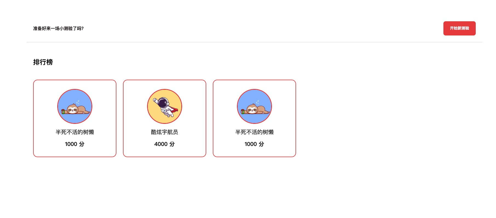
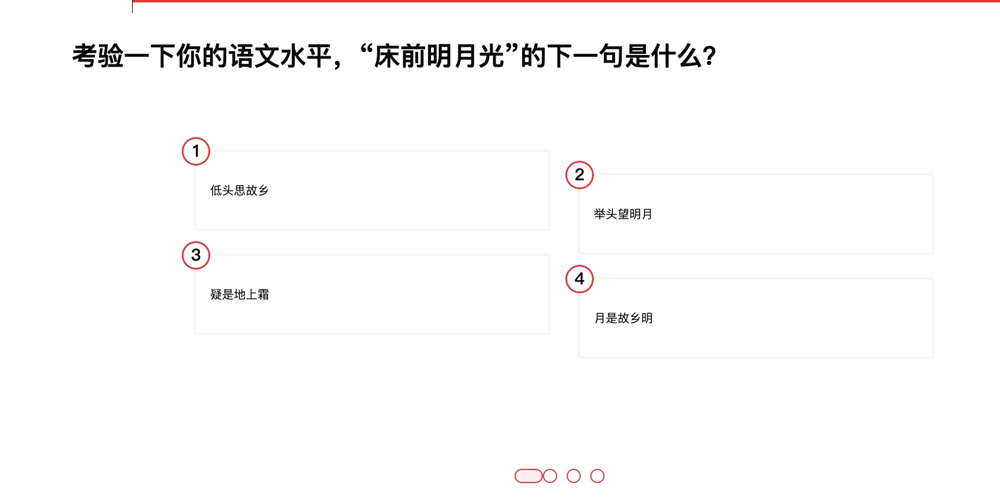
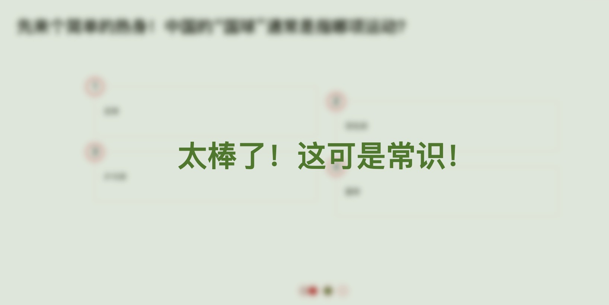

## 趣问派对 (Quiz Party)
一个基于 Vue3 的超好玩问答游戏！你可以挑战各种有趣的题目，测试你的知识储备！

<br />

  
<div align="center">
  
  

开始页面

<br />
  

测验页面

<br />
  

哎呀！

<br />

    
太棒了！
  
</div>

## 快速开始
运行以下脚本，**Boom 💥** 你就可以开始玩了！

```shell
$ yarn install # 或 npm install
$ yarn dev # 或 npm run dev
```

## ✏ 待办事项

- [X] ~~使用 Composition API~
- 【】
- [ ] 添加更多测验和角色
